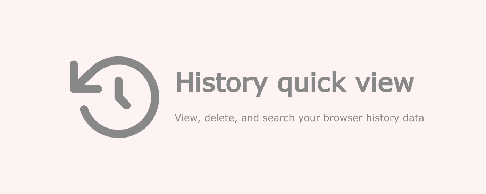

### 
v0.3.1

created by Axel Ariel Saravia

---

[*History quick view*](https://chromewebstore.google.com/detail/history-quick-view/ednfjcijimijfccmlfbeejidmbekdmic)
is a simple chrome extensions for use and manage simple tasks with your browser history data.

This extension is created for my own necessities. If you have some bugs or you need other utilities please contact me.

### Some of the usabilities are: 
- see your most current history, but you can navigate all your history.
- delete a history url.
- delete a complete history day data.
- search a history query.
- shortcut button to the browser history manager
- shortcut button to the browser history data cleaner

### Some user configurations:
- You can set if the url opens in the current tab or in a new tab.
- You can specify when a new tab is opens, go to it (focus it) or stay in your current tab.

### Some keyboard shortcuts:

| Command | Description |
| --- | ---|
| <kbd>Ctrl</kbd> + <kbd>Enter</kbd> or <kbd>Ctrl</kbd> + mouse click| Opens the url in a contrary way of the configurations
| <kbd>Shift</kbd> + <kbd>Enter</kbd> or <kbd>Shift</kbd> + mouse click| Opens the url in a new windows |
| <kbd>q</kbd> | Delete the url selected |

---

The icons used in the extension are from [Feather Icons](https://feathericons.com/).

The inspiration of this extension comes from the [Edge Browser](https://www.microsoft.com/en-us/edge) history extension.
